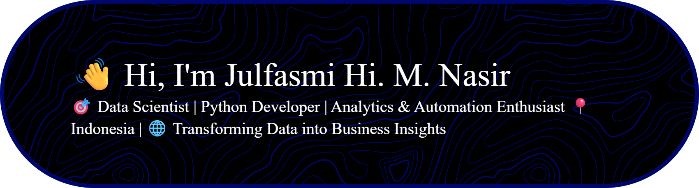

# 👋 Hi, I'm Julfasmi Hi. M. Nasir

🎯 **Data Scientist | Python Developer | Analytics & Automation Enthusiast**  
📍 Indonesia | 🌐 Transforming Data into Business Insights
<!--  -->

---

## 🚀 About Me

I'm a passionate data professional with a background in **Statistics** and over **2 years of experience** working on real-world data problems. I specialize in **data analysis**, **machine learning**, and **automation**, with strong hands-on experience in both **technical** and **analytical tools**.

I'm constantly exploring the intersection of **code, insight, and impact** — turning raw data into clear and actionable business solutions.

---

## 🛠️ Tech & Tools

### 💻 Programming & Scripting
- Python, R, SQL, Excel VBA

### 📦 Libraries & Frameworks
- Pandas, NumPy, Scikit-Learn, TensorFlow, OpenCV, YOLO, FastAPI, Flask

### 📊 Data Analytics & Visualization
- Power BI, Tableau, Google Data Studio, Matplotlib, Seaborn, SPSS, Minitab

### 🧠 Machine Learning & Modeling
- Supervised & Unsupervised ML, ARIMA/SARIMA, Deep Learning (CNN, LSTM), Clustering, Forecasting

### ☁️ Deployment & Dev Tools
- Git & GitHub, Railway, FastAPI

---

## 📫 Let's Connect

- 🔗 [LinkedIn](https://www.linkedin.com/in/julfasmihmnasir)    
- 📧 Email: julfasmi.19@gmail.com  

---

⭐ *Thanks for visiting! Feel free to explore my repositories and connect if you find something interesting or useful.*

---

## 🕹️ Let's Play

<picture>
  <source media="(prefers-color-scheme: dark)" srcset="https://raw.githubusercontent.com/maurodesouza/maurodesouza/output/pacman-contribution-graph-dark.svg">
  <source media="(prefers-color-scheme: light)" srcset="https://raw.githubusercontent.com/maurodesouza/maurodesouza/output/pacman-contribution-graph.svg">
  
</picture>
